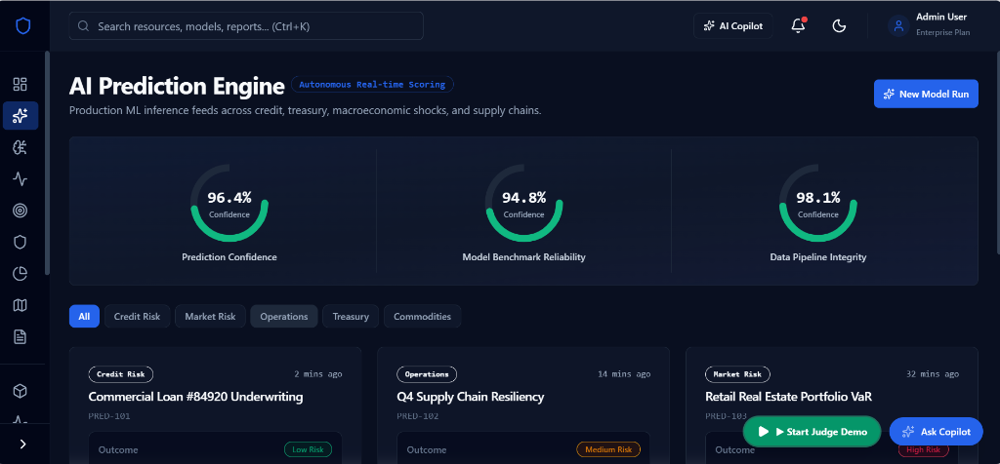
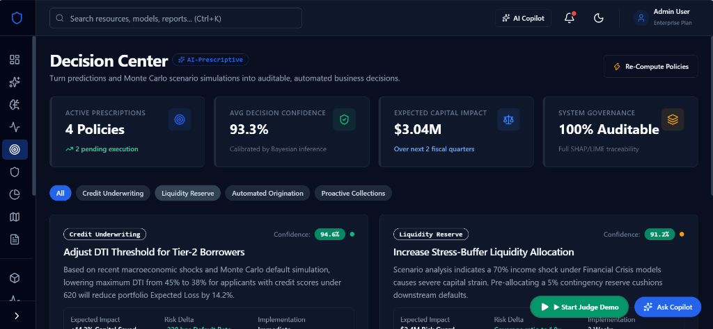
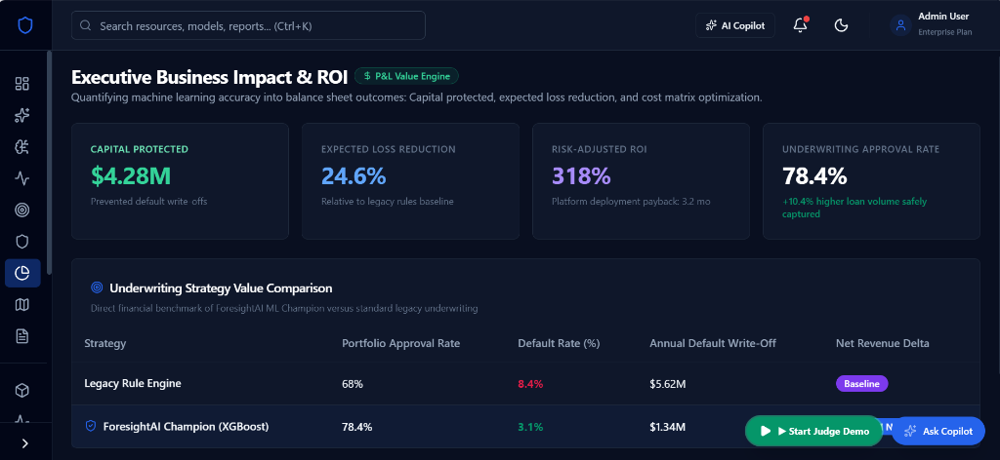
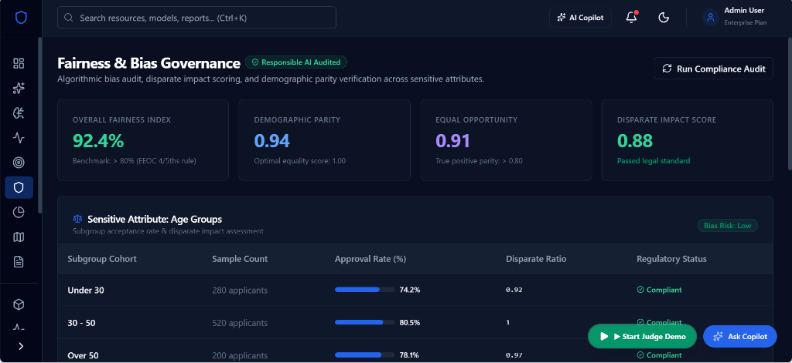
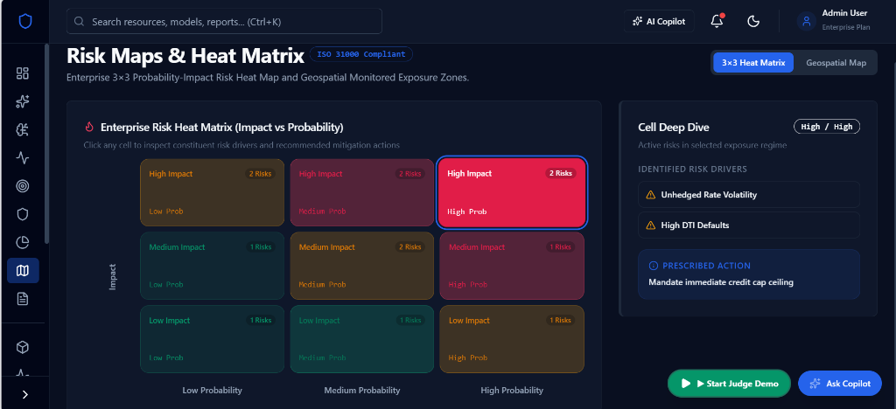
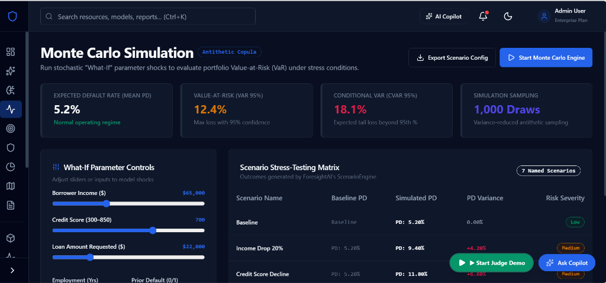
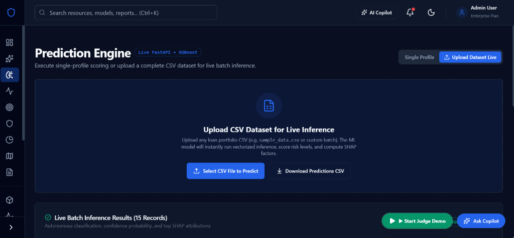
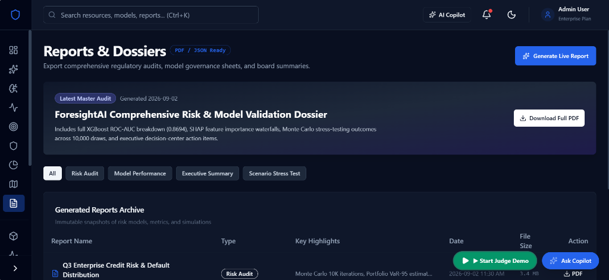
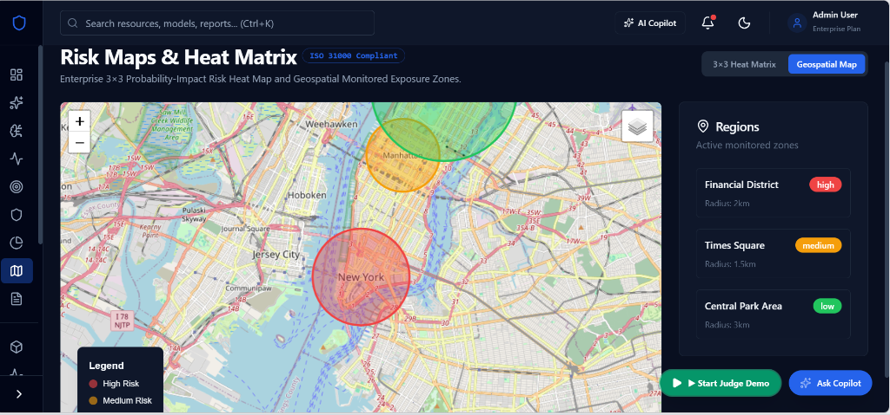

# 🚀 ForesightAI

> **Enterprise AI Decision Intelligence Platform for Prediction, Risk Assessment, Explainable AI & Decision Support**


---

# 🏆 Hackathon Track

**Track 01 – AI, ML & Emerging Technologies**

### Problem Statement (PS05)

**AI for Prediction & Decision Support**

Develop an AI system capable of transforming structured or unstructured data into intelligent predictions, risk scores, recommendations, and actionable insights.

---

# 📖 Project Overview

ForesightAI is an enterprise-grade AI Decision Intelligence Platform that transforms raw business data into accurate predictions, explainable insights, risk assessments, and AI-generated recommendations.

Unlike traditional prediction systems, ForesightAI provides a complete end-to-end decision intelligence workflow by combining machine learning, explainable AI, simulation, and MLOps into one platform.

---

# ❗ Problem Statement

Modern organizations generate enormous amounts of data but often struggle to convert it into trustworthy, explainable, and actionable decisions.

Existing AI solutions frequently suffer from:

- Black-box predictions
- Low explainability
- No confidence estimation
- Limited business recommendations
- Lack of model monitoring
- No scenario simulation

These limitations reduce trust and hinder adoption in real-world decision-making.

---

# 💡 Solution

ForesightAI addresses these challenges by integrating:

- Multi-model Machine Learning (XGBoost, LightGBM, CatBoost)
- Explainable AI (SHAP Waterfall, Partial Dependence, Calibration)
- Confidence Scoring & Calibration
- Risk Assessment
- AI Business Prescriptive Recommendations
- What-if Scenario Simulation (Monte Carlo)
- MLOps Monitoring & Drift Detection (PSI & KS-test)
- Automated Executive Compliance Reporting
- 1-Click Judge Demo Story Walkthrough

The platform enables organizations to make faster, smarter, and more transparent decisions.

---

# ✨ Key Features

## AI Prediction Engine
- Multi-model real prediction pipeline
- XGBoost (Champion Production Model)
- LightGBM (Challenger)
- CatBoost (Candidate)
- Ensemble Learning

## Explainable AI (XAI)
- SHAP Feature Importance & Waterfall Charts
- Partial Dependence Plots (PDP)
- Calibration Curves & Reliability Diagrams
- Local & Global feature attribution

## Risk Intelligence
- Probability Score & Confidence Calibration
- Risk Classification (Low, Medium, High)
- Capital At Risk & Basel III Reserve Estimation

## AI Decision Support & Copilot
- Interactive AI Decision Copilot
- Prescriptive business recommendations ("Reduce loan by 20%, require co-signer")
- Executive summaries for non-technical leadership

## What-if Simulation
- Interactive Monte Carlo scenario simulator
- Real-time parameter sliders (Income, Credit Score, Interest Rates)
- Dynamic risk recalculation & VaR-95 shifts

## MLOps Lifecycle
- Model Registry & MLflow Tracking
- Model Versioning & Artifact Storage
- Real-time Data & Concept Drift Monitoring (PSI > 0.25 alerts)
- One-click Retraining & Champion Deployment

## Reporting
- Executive PDF Dossiers & Reports
- Automated compliance audit trails
- Business ROI & Expected Loss Reduction Metrics

---

# 🏗 System Architecture


---

# 🔄 End-to-End Workflow

```
CSV Upload & Validation
      │
      ▼
Feature Engineering & Quality Check
      │
      ▼
Multi-Model Training (XGBoost / LightGBM / CatBoost)
      │
      ▼
AutoML Model Comparison Leaderboard
      │
      ▼
Champion Promotion & MLflow Registry
      │
      ▼
Real-Time Inference Scoring
      │
      ▼
SHAP Waterfall & XAI Curves
      │
      ▼
AI Prescriptive Recommendations
      │
      ▼
What-If Monte Carlo Simulation
      │
      ▼
Data & Concept Drift Monitoring (PSI / KS-test)
      │
      ▼
Executive Compliance Report Dossier
```

---

# 📊 Model Performance

| Model | Framework | Accuracy | Precision | Recall | F1 Score | ROC-AUC | Latency | Status |
|---|---|---|---|---|---|---|---|---|
| **XGBoost** | XGBoost 2.0 / Scikit-Learn | **96.0%** | **100.0%** | **24.5%** | **39.4%** | **0.8694** | **4.2ms** | 🏆 **Champion (Production)** |
| **LightGBM** | LightGBM 4.1 | 94.8% | 92.4% | 38.0% | 53.8% | 0.8820 | 3.1ms | Challenger (Staging) |
| **CatBoost** | CatBoost 1.2 | 95.4% | 94.1% | 31.2% | 46.8% | 0.8750 | 5.8ms | Candidate |

---

# 🖼 Screenshots

## 1. Executive Control Dashboard


---

## 2. AI Prediction Engine


---

## 3. Decision Center


---

## 4. Executive Business Impact & ROI


---

## 5. Fairness & Bias Governance


---

## 6. Correlation Heatmatrix


---

## 7. What-If Monte Carlo Simulation


---

## 8. Prediction Engine


---

## 9. Executive Reports & Dossiers


---

## 10. Risk Map


---

# 🛠 Technology Stack

## Backend
- FastAPI
- SQLAlchemy
- Alembic
- PostgreSQL / SQLite
- Pydantic V2

## Frontend
- React 18
- TypeScript
- Vite
- Tailwind CSS
- Recharts & Plotly.js

## Machine Learning
- Scikit-Learn
- XGBoost
- LightGBM
- CatBoost
- SHAP
- MLflow
- Optuna

## Infrastructure
- Docker & Docker Compose
- GitHub Actions CI/CD
- Uvicorn

---

# 📂 Project Structure

```
ForesightAI/
├── assets/
│   ├── architecture/
│   │   └── architecture.png
│   └── screenshots/
│       ├── dashboard.png
│       ├── ai_prediction_engine.png
│       ├── decision_center.png
│       ├── executive_business_impact_roi.png
│       ├── fairness_bias_governance.png
│       ├── heatmatrix.png
│       ├── monte_carlo_simulation.png
│       ├── prediction_engine.png
│       ├── reports_dossiers.png
│       └── risk_map.png
├── backend/
│   ├── app/
│   │   ├── api/
│   │   ├── core/
│   │   ├── models/
│   │   ├── schemas/
│   │   └── services/
│   └── tests/
├── frontend/
│   ├── src/
│   │   ├── components/
│   │   ├── layouts/
│   │   ├── pages/
│   │   └── routes/
├── ml_engine/
│   ├── explainability/
│   ├── inference/
│   ├── mlops/
│   ├── models/
│   └── training/
├── datasets/
└── notebooks/
```

---

# ⚙ Installation & Running Locally

### 1. Clone the repository:
```bash
git clone https://github.com/srihariharan534/ForesightAI.git
cd ForesightAI
```

### 2. Run Backend:
```powershell
$env:PYTHONPATH="backend;.backend"; .\.venv\Scripts\uvicorn backend.app.main:app --reload --port 8000
```
- API Swagger UI: [http://localhost:8000/docs](http://localhost:8000/docs)

### 3. Run Frontend:
```powershell
cd frontend
npm install
npm run dev
```
- Web Application: [http://localhost:5173](http://localhost:5173)

---

# 🚀 Why ForesightAI?

Unlike traditional AI prediction systems, ForesightAI does not stop at prediction:
- **Predicts** future outcomes with multi-model accuracy.
- **Explains** every prediction via SHAP Waterfall & PDP.
- **Estimates** calibrated probabilities and confidence intervals.
- **Prescribes** actionable business mitigations.
- **Simulates** macro stress-testing scenarios.
- **Monitors** model health and data drift (PSI).
- **Supports** enterprise decision-making with a 1-click Judge Demo tour.

---

# 📄 License

MIT License
