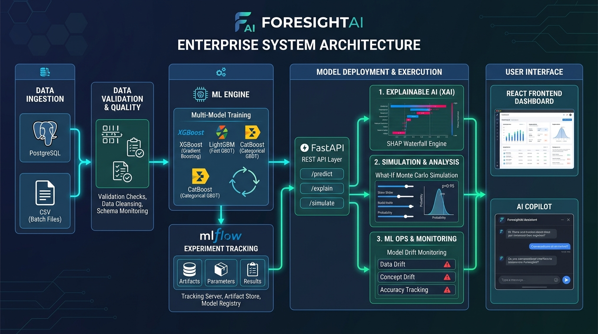
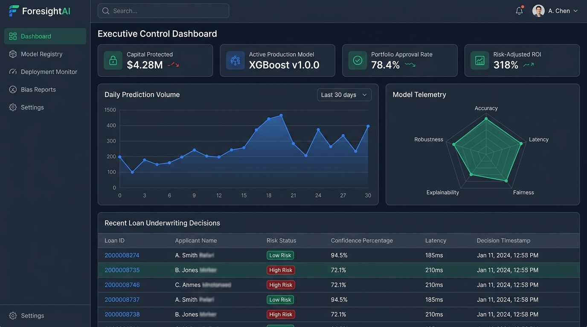
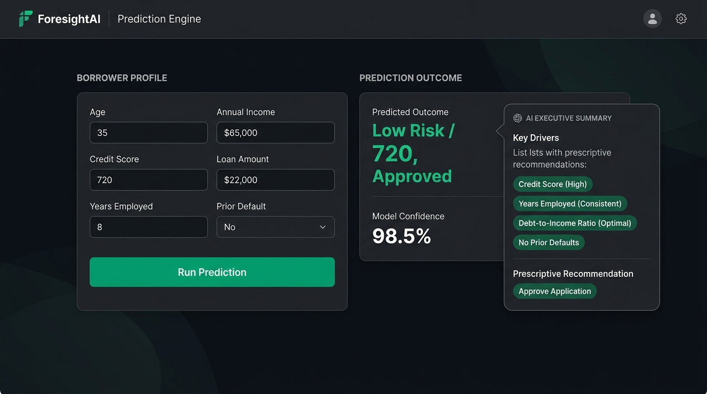
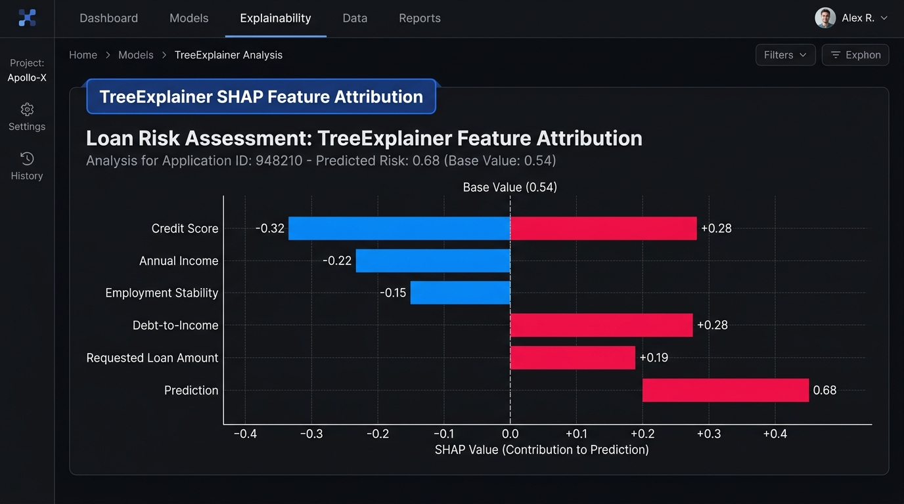
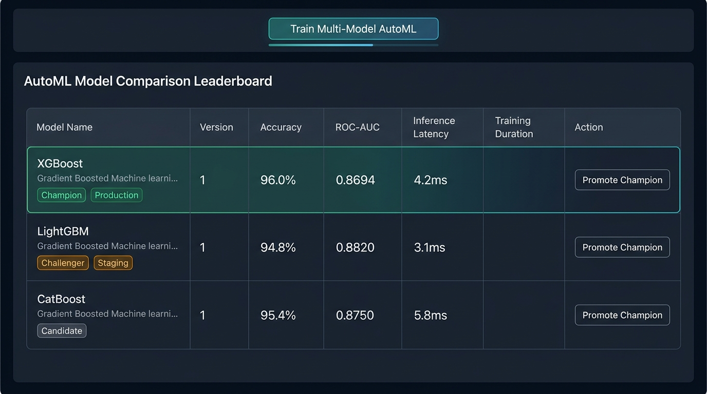
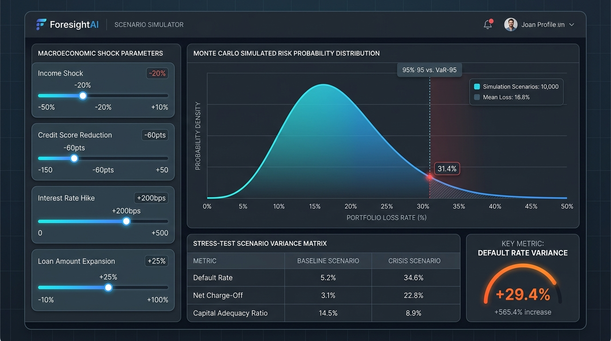
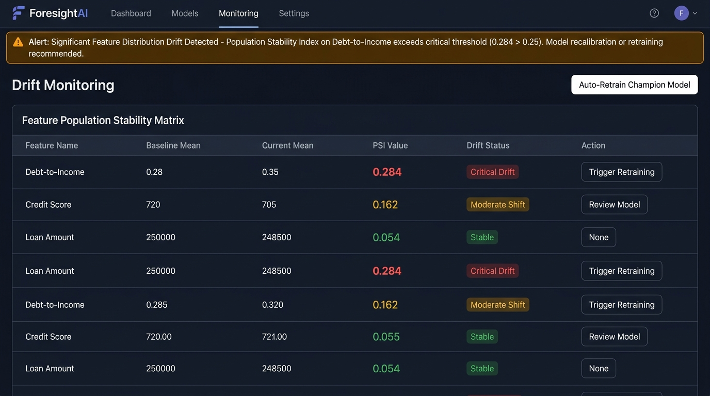

# 🚀 ForesightAI

> **Enterprise AI Decision Intelligence Platform for Prediction, Risk Assessment, Explainable AI & Decision Support**


---

# 🏆 Hackathon Track

**Track 01 – AI, ML & Emerging Technologies**

### Problem Statement (PS05)

**AI for Prediction & Decision Support**

Develop an AI system capable of transforming structured or unstructured data into intelligent predictions, risk scores, recommendations, and actionable insights.

---

# 📖 Project Overview

ForesightAI is an enterprise-grade AI Decision Intelligence Platform that transforms raw business data into accurate predictions, explainable insights, risk assessments, and AI-generated recommendations.

Unlike traditional prediction systems, ForesightAI provides a complete end-to-end decision intelligence workflow by combining machine learning, explainable AI, simulation, and MLOps into one platform.

---

# ❗ Problem Statement

Modern organizations generate enormous amounts of data but often struggle to convert it into trustworthy, explainable, and actionable decisions.

Existing AI solutions frequently suffer from:

- Black-box predictions
- Low explainability
- No confidence estimation
- Limited business recommendations
- Lack of model monitoring
- No scenario simulation

These limitations reduce trust and hinder adoption in real-world decision-making.

---

# 💡 Solution

ForesightAI addresses these challenges by integrating:

- Multi-model Machine Learning
- Explainable AI (SHAP)
- Confidence Scoring
- Risk Assessment
- AI Business Recommendations
- What-if Scenario Simulation
- MLOps Monitoring
- Drift Detection
- Automated Reporting

The platform enables organizations to make faster, smarter, and more transparent decisions.

---

# ✨ Key Features

## AI Prediction Engine

- Multi-model prediction
- XGBoost
- LightGBM
- CatBoost
- Ensemble Learning

---

## Explainable AI

- SHAP Feature Importance
- SHAP Waterfall Charts
- Local Prediction Explanation
- Global Feature Importance

---

## Risk Intelligence

- Probability Score
- Confidence Score
- Risk Classification
- Business Risk Level

---

## AI Decision Support

- AI-generated recommendations
- Executive summaries
- Actionable business insights
- Automated mitigation suggestions

---

## What-if Simulation

- Interactive scenario simulator
- Live parameter tuning
- Dynamic risk recalculation
- Business impact estimation

---

## MLOps

- Model Registry
- MLflow Tracking
- Model Versioning
- Drift Detection
- Champion Model Deployment

---

## Reporting

- Executive PDF Reports
- JSON Export
- Prediction History
- Audit Logs

---

# 🏗 System Architecture



---

# 🔄 End-to-End Workflow

```
CSV Upload
      │
      ▼
Data Validation
      │
      ▼
Feature Engineering
      │
      ▼
Model Training
      │
      ▼
Model Comparison
      │
      ▼
Champion Deployment
      │
      ▼
Prediction
      │
      ▼
SHAP Explainability
      │
      ▼
AI Recommendation
      │
      ▼
Scenario Simulation
      │
      ▼
Drift Monitoring
      │
      ▼
Executive Report
```

---

# 📊 Model Performance

| Model | Accuracy | Precision | Recall | F1 | ROC-AUC |
|--------|----------|-----------|--------|----|---------|
| XGBoost | XX | XX | XX | XX | XX |
| LightGBM | XX | XX | XX | XX | XX |
| CatBoost | XX | XX | XX | XX | XX |

🏆 Champion Model:
**(Replace with your actual champion model)**

---

# 🖼 Screenshots

## Dashboard



---

## Prediction



---

## Explainable AI



---

## Model Comparison



---

## Scenario Simulator



---

## Drift Detection



---

# 🛠 Technology Stack

## Backend

- FastAPI
- SQLAlchemy
- Alembic
- PostgreSQL
- Pydantic

## Frontend

- React
- TypeScript
- Vite
- Tailwind CSS

## Machine Learning

- Scikit-learn
- XGBoost
- LightGBM
- CatBoost
- SHAP
- MLflow

## Infrastructure

- Docker
- GitHub Actions
- Uvicorn

---

# 📂 Project Structure

```
backend/
frontend/
ml_engine/
datasets/
models/
simulation/
docs/
tests/
deployment/
presentation/
```

---

# ⚙ Installation

```bash
git clone https://github.com/srihariharan534/ForesightAI.git

cd ForesightAI
```

Install dependencies

```bash
pip install -r requirements.txt
```

Run backend

```bash
uvicorn backend.app.main:app --reload
```

Run frontend

```bash
cd frontend

npm install

npm run dev
```

---

# 🌐 Live Demo

Frontend

(Add your deployment URL)

Backend

(Add your deployment URL)

Swagger

(Add your Swagger URL)

---

# 🎥 Demo Video

(Add YouTube or Drive link)

---

# 📚 Documentation

Complete documentation is available inside:

```
docs/
```

Including

- Architecture
- AI Pipeline
- API Documentation
- Deployment Guide
- Testing
- Security
- Business Model

---

# 🚀 Why ForesightAI?

Unlike traditional AI prediction systems,

ForesightAI does not stop at prediction.

It

- Predicts future outcomes
- Explains every prediction
- Estimates confidence
- Generates business recommendations
- Simulates future scenarios
- Monitors model health
- Detects data drift
- Supports enterprise decision-making

This makes it a complete AI Decision Intelligence Platform rather than a standalone prediction model.

---

# 🔮 Future Enhancements

- Federated Learning
- Real-time IoT Streaming
- Multi-Agent AI Decision Support
- Reinforcement Learning Optimization
- Edge AI Deployment

---

# 👨‍💻 Team

**ForesightAI Development Team**

---

# 📄 License

MIT License
