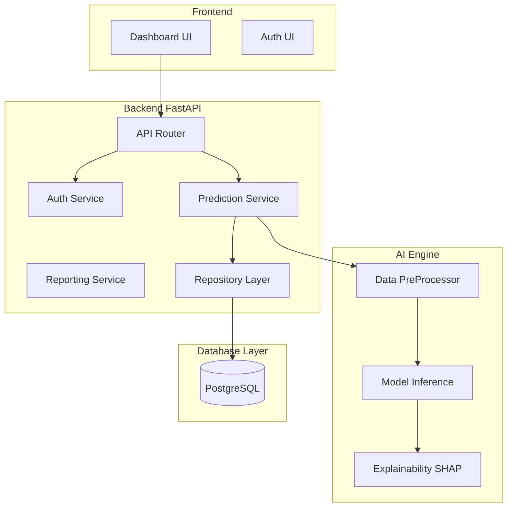

# Component Diagram

## Purpose
To detail the internal modular structure of the backend and AI subsystems within ForesightAI.

## Components
- **API Layer**: Exposes endpoints (Prediction, Auth, Simulation).
- **Service Layer**: Contains business logic (RecommendationService, SimulationService).
- **Data Access Layer (Repository)**: Abstracts database interactions (SQLAlchemy).
- **ML Preprocessing Component**: Cleans and scales incoming data.
- **Inference Component**: Wraps the trained XGBoost/LightGBM models.
- **Explainability Component**: Uses SHAP/LIME to generate insights.

## Data Flow
- Incoming requests hit the **API Layer**.
- Routed to the appropriate **Service Layer**.
- Data fetched/saved via the **Data Access Layer**.
- ML requests trigger the **ML Preprocessing** and **Inference Component**.

## Design Decisions
- Adopted **Clean Architecture** to decouple business logic from the web framework and database.
- Used the **Repository Pattern** to easily swap out SQLite (dev) for PostgreSQL (prod).

## Scalability Notes
- Independent services within the backend can be factored out into microservices if the application grows.

## Mermaid Diagram

