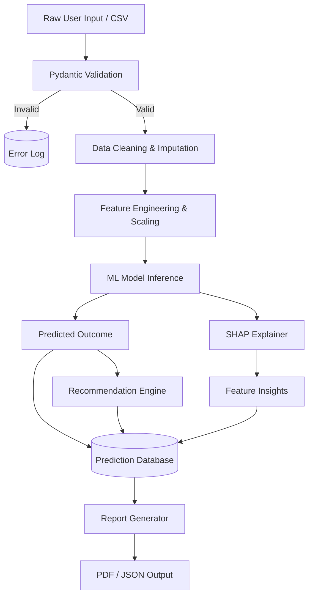

# Data Flow Diagram

## Purpose
To trace the movement of data from ingestion (raw) to presentation (reporting).

## Components
- **Input Sources**: API, CSV Uploads.
- **Processes**: Validation, Cleansing, Transformation, Inference, Recommendation.
- **Sinks**: Database, PDF Reports, Dashboard UI.

## Data Flow
Described by the Mermaid diagram below.

## Design Decisions
- Immutable logs: Prediction inputs and outputs are stored immutably to support auditing and future model retraining.

## Scalability Notes
- As data volume grows, the validation and cleansing processes can be offloaded to Spark or Pandas-on-Ray.

## Mermaid Diagram

