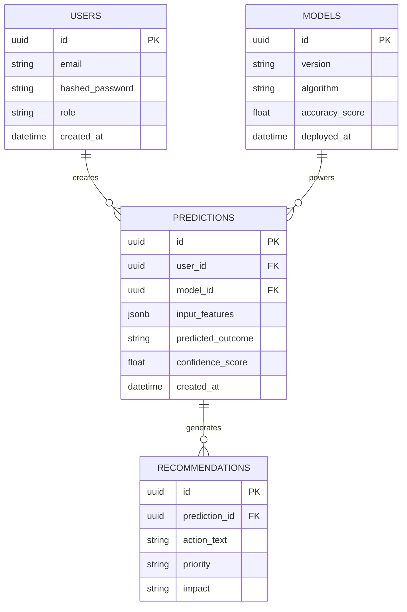

# Database Entity-Relationship Diagram

## Purpose
To map the relational schema used by SQLAlchemy for ForesightAI.

## Components
- **Users**: Authentication and profile data.
- **Predictions**: Stores historical inference requests and results.
- **Recommendations**: 1-to-N relationship with predictions.
- **Models**: Tracks deployed model metadata.

## Data Flow
- N/A

## Design Decisions
- Using UUIDs for primary keys to enhance security and prevent enumeration attacks.
- Foreign keys enforce data integrity between predictions and recommendations.

## Scalability Notes
- Indexes will be placed on `created_at` and `user_id` in the `Predictions` table to ensure fast history querying.

## Mermaid Diagram

