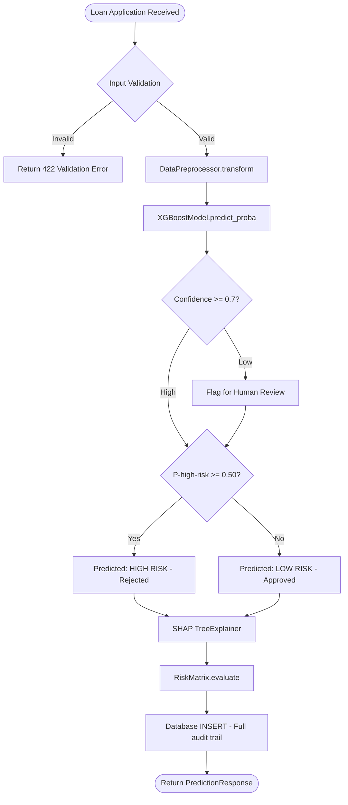
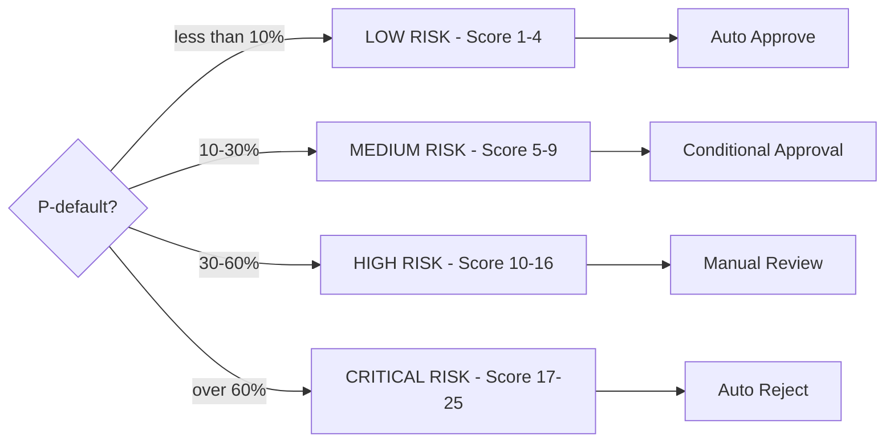
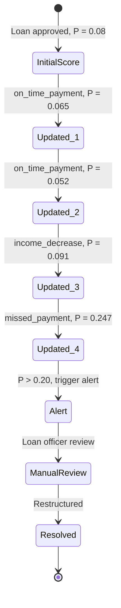

# ForesightAI — Decision Flow Architecture

> How ForesightAI makes and explains every loan risk decision.

---

## End-to-End Decision Flow



---

## Risk Classification Decision Tree



---

## SHAP Contribution Verification

Each prediction satisfies the local accuracy axiom:

```
P(default) = base_value + sum(SHAP contributions)
0.2800     = 0.053      + 0.227
```

Top contributors for a high-risk applicant:
- `has_previous_default`: +0.412 (largest positive push toward risk)
- `credit_score`: +0.199
- `income`: -0.143 (protective)
- `loan_amount`: +0.092
- `years_employed`: -0.052 (protective)

---

## Bayesian Risk Lifecycle

After initial scoring, risk is continuously updated via `ProbabilityEngine`:



---

## Scenario-Based Approval Policy

| Worst-Case P(default) | Decision | Capital Action |
|---|---|---|
| < 20% | Auto Approve | Standard reserve |
| 20–40% | Conditional Approval | 15% additional reserve |
| > 40% | Decline | Offer reduced loan amount |

---

## Outcome Traceability

Every decision is stored in the `predictions` table with:

- Full input feature vector (JSON)
- Predicted class + confidence score
- SHAP contribution dictionary
- Timestamp + UUID

This enables complete regulatory audit trail per RBI guidelines on AI-assisted credit decisions.
