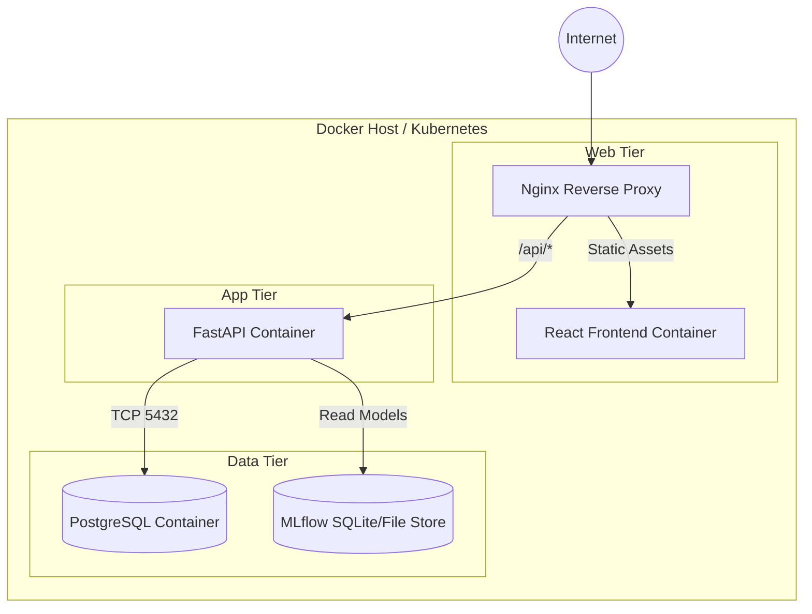

# Deployment Diagram

## Purpose
To describe how ForesightAI is deployed across containers and environments.

## Components
- Docker Host
- API Container (FastAPI, Uvicorn)
- Frontend Container (Nginx, React)
- Database Container (PostgreSQL)

## Data Flow
Traffic enters via Nginx, is routed to the static frontend or proxy-passed to the FastAPI backend container, which connects to the PostgreSQL container.

## Design Decisions
- **Docker Compose** is used for single-node deployment and local development.
- For production, this maps easily to Kubernetes (K8s) or AWS ECS.

## Scalability Notes
- The API container can be replicated using Kubernetes Deployments, while the PostgreSQL database can be moved to a managed service (e.g., Amazon RDS).

## Mermaid Diagram

