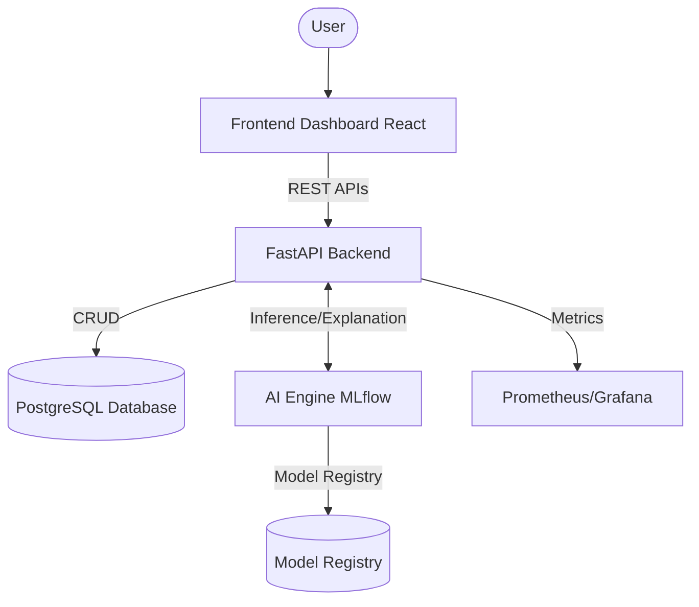

# High-Level Architecture

## Purpose
This document provides a bird's-eye view of the ForesightAI platform, illustrating how the frontend, backend, AI engine, and data layers interact.

## Components
- **Frontend (React 19)**: The user-facing dashboard for predictions, simulations, and insights.
- **API Gateway / Backend (FastAPI)**: Routes requests, handles authentication, and orchestrates services.
- **AI Engine (Python)**: Executes predictions, confidence scoring, and SHAP explanations.
- **Database (PostgreSQL)**: Stores users, history, and model metadata.
- **Cache (Redis - Optional)**: For fast retrieval of recent predictions.
- **Monitoring (Prometheus/Grafana)**: Tracks system health and ML metrics.

## Data Flow
1. User interacts with the Frontend Dashboard.
2. Frontend sends a REST request to the FastAPI Backend.
3. Backend validates the request and queries the AI Engine.
4. AI Engine runs inference, computes confidence and explanations.
5. Backend stores results in the Database and returns the response to the Frontend.

## Design Decisions
- Selected **FastAPI** for its high performance and async capabilities, ideal for ML workloads.
- Separated the **AI Engine** logically to allow independent scaling of inference nodes in the future.

## Scalability Notes
- The architecture supports horizontal scaling of the backend and AI inference workers.
- Stateless APIs allow easy deployment behind a load balancer (e.g., NGINX or AWS ALB).

## Mermaid Diagram

