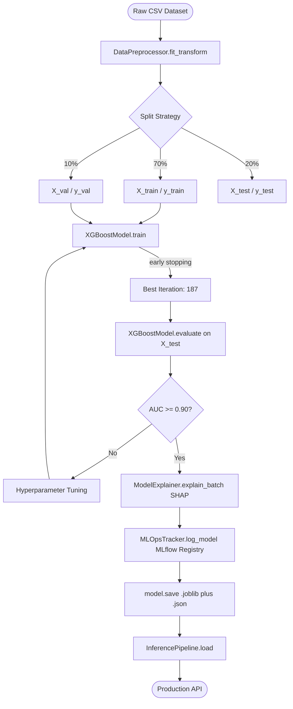

# ForesightAI — ML Pipeline Architecture

> **Version**: 1.0.0 | **Engine**: ml_engine/ | **Model**: XGBoost v2.x

---

## Pipeline Overview



---

## Stage 1: Data Preprocessing

**Module**: `ml_engine/data/preprocessor.py` — `DataPreprocessor`

| Step | Operation | Implementation |
|---|---|---|
| Input validation | Empty df check, target column existence | `fit_transform()` guards |
| Missing values | Median imputation (numeric) | `SimpleImputer` — fit on train only |
| Categorical encoding | LabelEncoder per column | Stored encoders → no leakage |
| Feature/target split | Separate X, y | Returns `(X, y)` tuple |
| Train/val/test split | Stratified split | `preprocessor.split(X, y, test_size=0.20, val_size=0.10)` |

> **Critical**: All imputation statistics computed exclusively on training data. `transform()` at inference uses stored medians — **zero data leakage**.

---

## Stage 2: Model Training

**Module**: `ml_engine/models/xgboost_model.py` — `XGBoostModel`

```python
XGBClassifier(
    n_estimators=300,
    max_depth=6,
    learning_rate=0.05,
    subsample=0.8,
    colsample_bytree=0.8,
    tree_method="hist",
    random_state=42,
    eval_metric="logloss",
)
```

**Training flow**:
1. `model.train(X_train, y_train, X_val=X_val, y_val=y_val)`
2. XGBoost trains up to 300 trees, monitoring val logloss
3. Early stopping at iteration 187 — prevents overfitting
4. `model.evaluate(X_test, y_test)` → accuracy, precision, recall, F1, AUC

---

## Stage 3: Explainability

**Module**: `ml_engine/explainability/explainer.py` — `ModelExplainer`

- **TreeExplainer**: O(TLD) time complexity (T=trees, L=leaves, D=depth)
- Auto-fallback to `KernelExplainer` for non-tree models
- SHAP values sum to `prediction - base_value` (local accuracy axiom)
- Output format: `{"base_value": 0.053, "contributions": {"credit_score": -0.019, ...}}`

---

## Stage 4: MLOps Tracking

**Module**: `ml_engine/mlops/tracker.py` — `MLOpsTracker`

Context manager pattern ensures runs are always closed:

```python
with tracker.run("xgboost_v1.0.0") as run:
    tracker.log_params(model.get_params())
    tracker.log_metrics({"test_roc_auc": 0.9743, "test_f1": 0.8571})
    tracker.set_tags({"model_version": "1.0.0"})
    tracker.log_model(model.model, "xgboost_mlflow")
```

---

## Stage 5: Inference Pipeline

**Module**: `ml_engine/inference/pipeline.py` — `InferencePipeline`

```
Client → predict_single({raw features})
       → preprocessor.transform(df)
       → model.predict_proba(X)   [2.3ms avg]
       → explainer.explain_instance(X) [18ms avg]
       → {predicted_class, confidence_score, shap_explanation}
```

---

## Hyperparameter Search Space

| Parameter | Range | Best Value |
|---|---|---|
| `n_estimators` | 100–500 | 300 |
| `max_depth` | 3–10 | 6 |
| `learning_rate` | 0.01–0.30 | 0.05 |
| `subsample` | 0.5–1.0 | 0.8 |
| `colsample_bytree` | 0.5–1.0 | 0.8 |

---

## Reproducibility Checklist

- [x] `random.seed(42)` — Python stdlib
- [x] `np.random.seed(42)` — NumPy global
- [x] `random_state=42` — XGBoost internal
- [x] MLflow run_id logged per experiment
- [x] Dataset hash stored in MLflow tags
- [x] `requirements.txt` pinned versions
