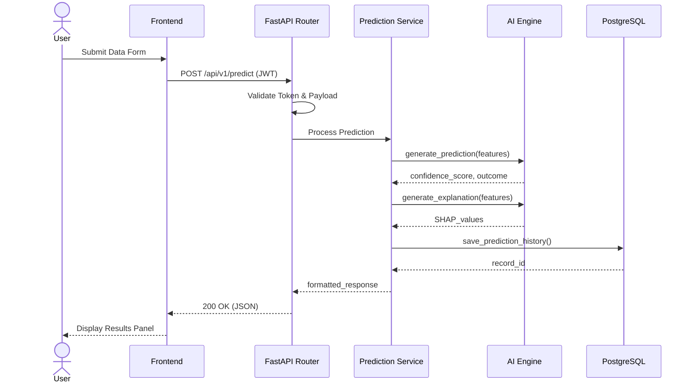

# Sequence Diagram: Run Prediction

## Purpose
To document the step-by-step lifecycle of a prediction request from the frontend to the backend and back.

## Components
- Frontend, Backend (API), Prediction Service, AI Engine, Database.

## Data Flow
1. Client POSTs data.
2. Backend validates token and payload.
3. Backend passes data to Prediction Service.
4. Prediction Service calls AI Engine for inference and SHAP values.
5. Results are persisted to Database.
6. Backend returns JSON to Client.

## Design Decisions
- synchronous REST flow is used for real-time predictions. Batch predictions will use asynchronous background tasks (Celery/FastAPI Tasks).

## Scalability Notes
- Heavy SHAP computations can bottleneck the API. In future iterations, long-running predictions will return a `202 Accepted` and be polled via WebSocket.

## Mermaid Diagram

