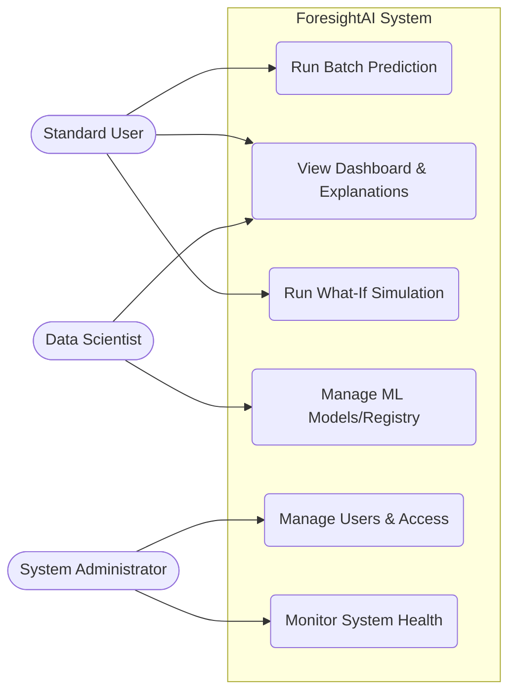

# Use Case Diagram

## Purpose
To map the core user roles to their corresponding actions within ForesightAI.

## Components
- **Actors**: Standard User, Data Scientist, System Administrator.
- **Use Cases**: Run Prediction, Run Simulation, View History, Manage Models, Monitor Health.

## Data Flow
N/A - This represents actor-system interactions.

## Design Decisions
- Role-Based Access Control (RBAC) ensures only admins can manage users and models, while standard users focus on predictions.

## Scalability Notes
- Adding new roles (e.g., "Auditor") will require extending the JWT claims and backend RBAC middleware.

## Mermaid Diagram

