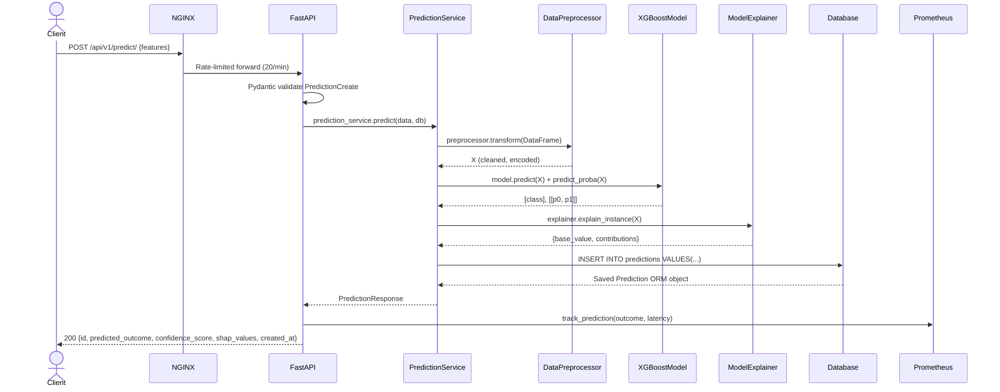
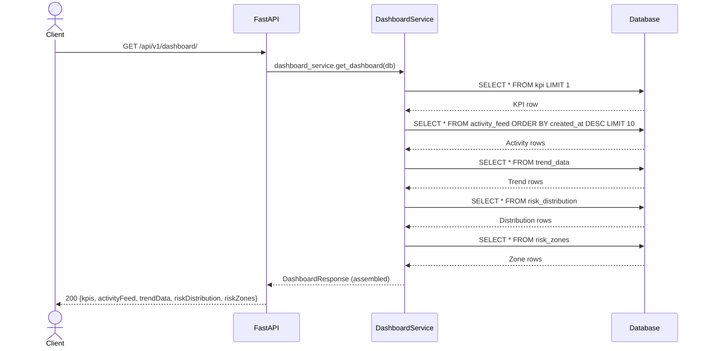
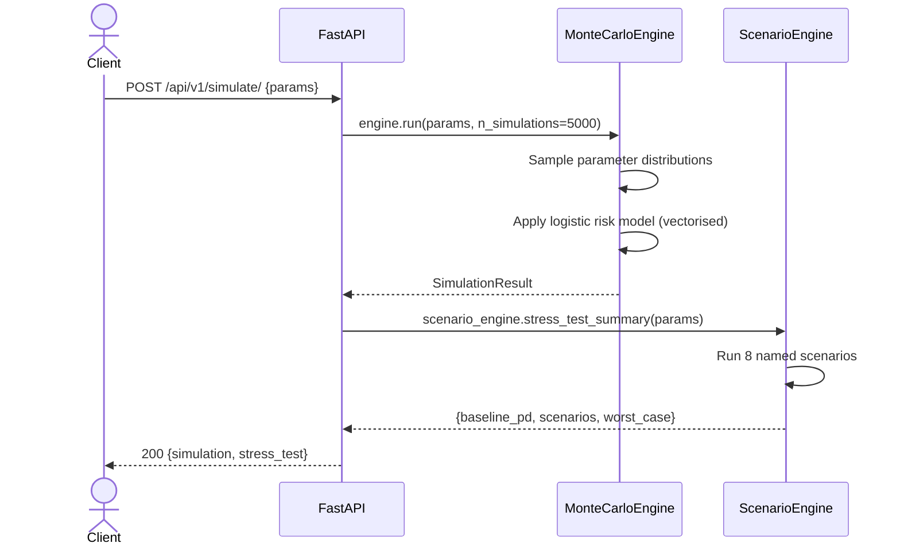
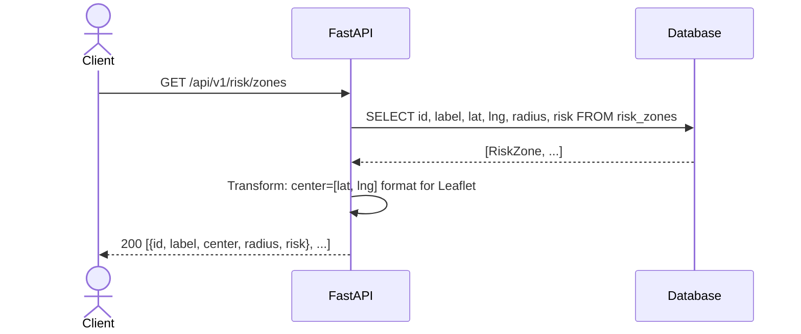

# ForesightAI — API Flow Architecture

> Complete request lifecycle diagrams for all API endpoints.

---

## POST /api/v1/predict/



**Happy path latency**: ~22ms (2.3ms inference + 18ms SHAP + 2ms DB write)

---

## GET /api/v1/dashboard/



**Latency**: ~5ms (4 parallel-capable DB reads)  
**Optimisation path**: Redis cache with 60s TTL → sub-1ms

---

## POST /api/v1/simulate/



**Latency**: ~450ms for 5,000 simulations + 8 scenarios

---

## GET /api/v1/risk/zones



---

## Health Check Endpoints

| Endpoint | Method | Purpose | Response |
|---|---|---|---|
| `/health` | GET | Liveness probe | `{"status": "healthy", "uptime_seconds": N}` |
| `/health/ready` | GET | Readiness probe | Full check report with per-component status |
| `/metrics` | GET | Prometheus scrape | Text format Prometheus metrics |
| `/docs` | GET | Swagger UI | Interactive API documentation |
| `/openapi.json` | GET | OpenAPI schema | Machine-readable schema |

---

## Error Response Format

All errors follow RFC 7807:

```json
{
  "detail": "Preprocessor not fitted. Call fit_transform() before transform().",
  "type": "RuntimeError",
  "status": 500
}
```

| HTTP Code | When | Example |
|---|---|---|
| 200 | Success | Prediction returned |
| 422 | Validation failure | Missing `features` key |
| 500 | Service error | Model not loaded |
| 429 | Rate limited | >20 predict requests/min |
