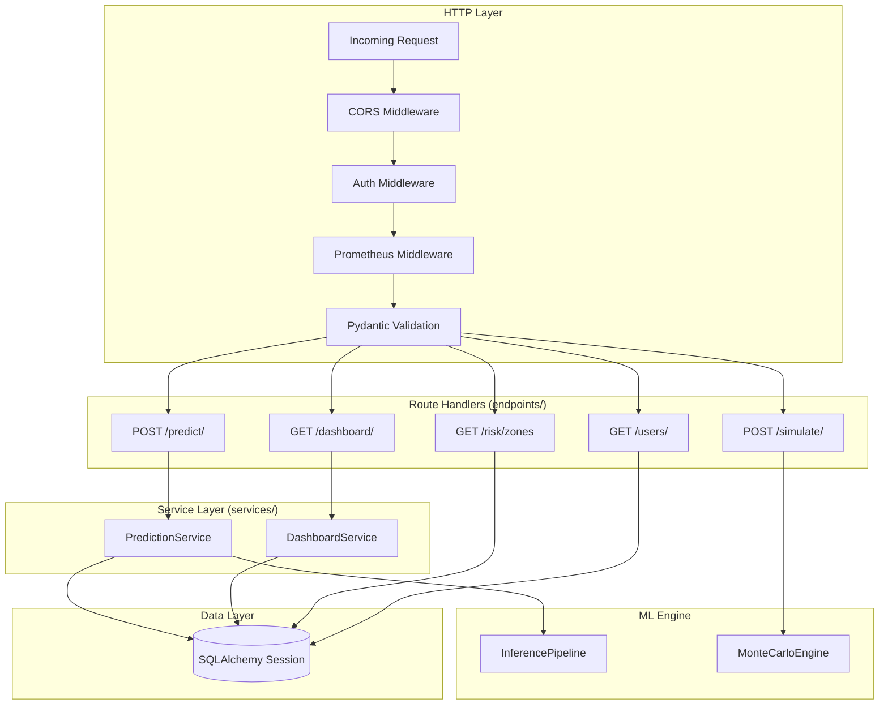
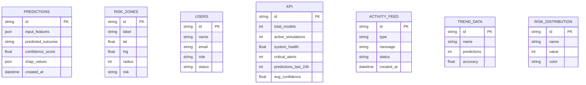

# ForesightAI — Backend Architecture

> **Framework**: FastAPI 0.103 | **Language**: Python 3.11 | **ORM**: SQLAlchemy 2.x

---

## Directory Structure

```
backend/
├── app/
│   ├── main.py                    # FastAPI app factory, lifespan, middleware
│   ├── core/
│   │   ├── config.py              # Pydantic BaseSettings
│   │   └── database.py            # SQLAlchemy engine, session factory
│   ├── api/
│   │   └── api_v1/
│   │       ├── api.py             # APIRouter aggregator
│   │       └── endpoints/
│   │           ├── predict.py     # POST /predict/
│   │           ├── dashboard.py   # GET /dashboard/
│   │           ├── risk.py        # GET /risk/zones
│   │           ├── simulation.py  # POST /simulate/
│   │           └── users.py       # GET /users/
│   ├── models/                    # SQLAlchemy ORM models
│   │   ├── prediction.py          # Prediction table
│   │   ├── risk.py                # RiskZone table
│   │   ├── user.py                # User table
│   │   └── dashboard.py           # KPI, ActivityFeed, TrendData, RiskDistribution
│   ├── schemas/                   # Pydantic v2 request/response schemas
│   │   ├── prediction.py          # PredictionCreate, PredictionResponse
│   │   ├── risk.py                # RiskZoneItem
│   │   └── dashboard.py           # DashboardResponse
│   └── services/                  # Business logic layer
│       ├── prediction_service.py  # ML inference orchestration
│       └── dashboard_service.py   # KPI aggregation
```

---

## Layer Architecture



---

## API Router Configuration

```python
# api/api_v1/api.py
router = APIRouter()
router.include_router(predict.router,    prefix="/predict",   tags=["Prediction"])
router.include_router(dashboard.router,  prefix="/dashboard", tags=["Dashboard"])
router.include_router(risk.router,       prefix="/risk",      tags=["Risk"])
router.include_router(simulation.router, prefix="/simulate",  tags=["Simulation"])
router.include_router(users.router,      prefix="/users",     tags=["Users"])

# app/main.py
app.include_router(api_router, prefix="/api/v1")
```

---

## Database Schema



---

## Key Design Decisions

| Decision | Choice | Rationale |
|---|---|---|
| ORM | SQLAlchemy 2.x | Type-safe, async-ready, vendor-neutral |
| Validation | Pydantic v2 | 5–10x faster than v1; native `model_config` |
| DB (dev) | SQLite | Zero-config, file-based, test-friendly |
| DB (prod) | PostgreSQL | ACID, concurrent writes, JSON column support |
| Session injection | `Depends(get_db)` | Testable; cleanly overridden in tests |
| Async | Sync (uvicorn) | ML inference is CPU-bound; async adds no benefit here |
| CORS | `CORSMiddleware` | Allow `http://localhost:5173` in dev |

---

## Error Handling

All endpoints follow RFC 7807 Problem Details pattern:

```json
{
  "detail": "Prediction failed: Model not loaded.",
  "status": 500,
  "type": "InferenceError"
}
```

- 422 Unprocessable Entity: Pydantic validation failures (auto-generated)
- 500 Internal Server Error: Unhandled ML exceptions (caught in service layer)
- 404 Not Found: Resource lookup failures
