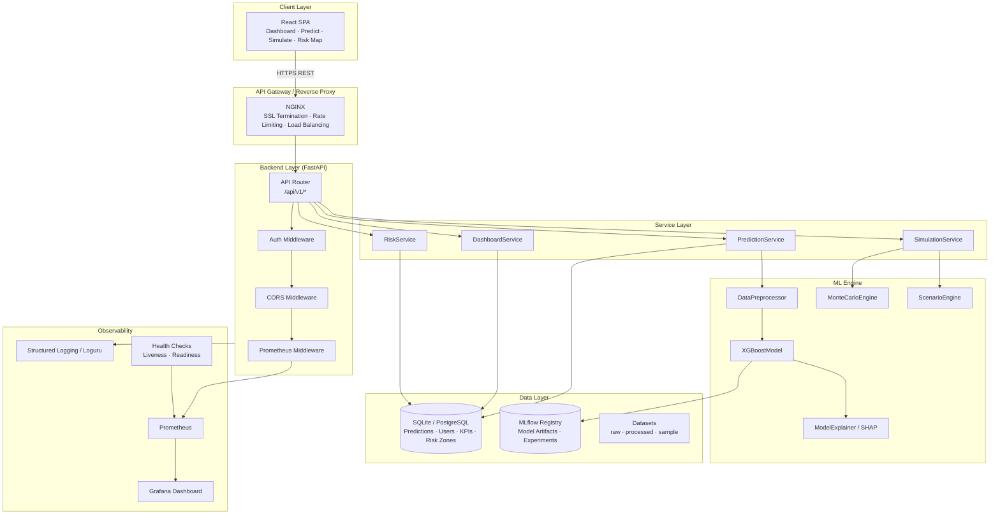
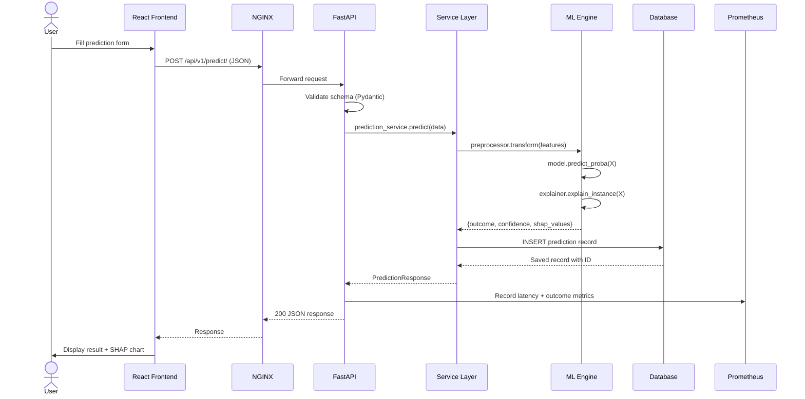
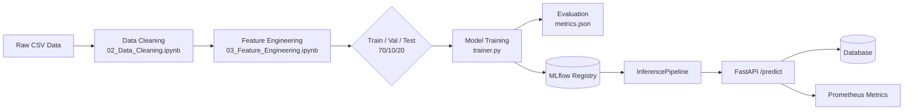
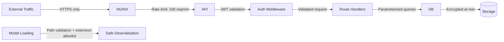

# ForesightAI — System Architecture

> **Version**: 1.0.0 | **Last Updated**: September 2026 | **Status**: Production

## Overview

ForesightAI is a cloud-native, microservices-inspired AI platform for loan risk prediction, Monte Carlo simulation, and explainable decision support. The system is built on a three-tier architecture: a React SPA frontend, a FastAPI backend, and a standalone ML Engine — all communicating via RESTful JSON APIs and integrated with MLflow for model lifecycle management.

---

## High-Level System Diagram



---

## Component Breakdown

| Component | Technology | Responsibility |
|---|---|---|
| **Frontend** | React 18, Recharts, Leaflet | Dashboard UI, prediction form, risk map |
| **API Gateway** | NGINX 1.25 | SSL, rate limiting, static asset serving |
| **Backend API** | FastAPI 0.103, Python 3.11 | REST endpoints, request validation, DB I/O |
| **ML Engine** | XGBoost 2.x, SHAP, scikit-learn | Training, inference, explainability |
| **Simulation** | NumPy, SciPy | Monte Carlo, scenario analysis, risk matrix |
| **Database** | SQLite (dev) / PostgreSQL (prod) | Persistence for predictions, users, KPIs |
| **Model Registry** | MLflow 2.7 | Experiment tracking, model versioning |
| **Monitoring** | Prometheus + Grafana | Metrics collection and visualisation |

---

## Request Flow



---

## Data Flow Architecture



---

## Technology Stack Summary

```
┌─────────────────────────────────────────────────────────────┐
│                      ForesightAI Stack                      │
├─────────────┬───────────────────────────────────────────────┤
│ Layer       │ Technologies                                  │
├─────────────┼───────────────────────────────────────────────┤
│ Frontend    │ React 18 · Recharts · Leaflet · Axios        │
│ API         │ FastAPI · Uvicorn · Pydantic v2              │
│ ML          │ XGBoost · SHAP · scikit-learn · NumPy/SciPy  │
│ MLOps       │ MLflow · joblib · Optuna                     │
│ Database    │ SQLAlchemy · Alembic · SQLite/PostgreSQL      │
│ DevOps      │ Docker · docker-compose · GitHub Actions     │
│ Monitoring  │ Prometheus · Grafana · Loguru                │
│ Testing     │ pytest · httpx · pytest-cov                  │
│ Security    │ python-jose · passlib[bcrypt]                │
└─────────────┴───────────────────────────────────────────────┘
```

---

## Scalability Considerations

- **Horizontal scaling**: Backend stateless; can run N replicas behind NGINX upstream.
- **ML inference**: Model loaded once at startup; thread-safe for concurrent reads.
- **Database**: SQLite → PostgreSQL migration via Alembic with zero code changes.
- **Async support**: FastAPI async endpoints ready; DB calls can be migrated to `asyncpg`.
- **Caching**: Redis can be added for dashboard KPI caching (sub-10ms response).
- **Batch inference**: `InferencePipeline.predict_batch()` handles bulk scoring efficiently.

---

## Security Architecture



| Threat | Mitigation |
|---|---|
| SQL Injection | SQLAlchemy ORM parameterised queries |
| Pickle RCE | Extension allowlist + path validation on `joblib.load()` |
| Secret exposure | `.env` files excluded from git; env vars in deployment |
| Rate abuse | NGINX rate limiting + FastAPI middleware |
| Model poisoning | MLflow signed artifacts + input schema validation |
